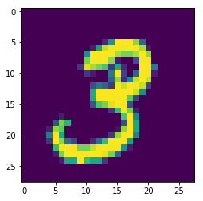
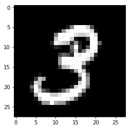
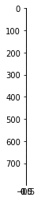
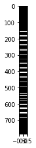

# MNIST Data Set - Basic Approach

### Get the MNIST Data


```python
import tensorflow as tf
```


```python
from tensorflow.examples.tutorials.mnist import input_data
```


```python
mnist = input_data.read_data_sets("MNIST_data/",one_hot=True)
```

    Extracting MNIST_data/train-images-idx3-ubyte.gz
    Extracting MNIST_data/train-labels-idx1-ubyte.gz
    Extracting MNIST_data/t10k-images-idx3-ubyte.gz
    Extracting MNIST_data/t10k-labels-idx1-ubyte.gz


** Alternative sources of the data just in case: **

* http://yann.lecun.com/exdb/mnist/
* https://github.com/mrgloom/MNIST-dataset-in-different-formats


```python
type(mnist)
```


    tensorflow.contrib.learn.python.learn.datasets.base.Datasets


```python
mnist.train.images
```


    array([[0., 0., 0., ..., 0., 0., 0.],
           [0., 0., 0., ..., 0., 0., 0.],
           [0., 0., 0., ..., 0., 0., 0.],
           ...,
           [0., 0., 0., ..., 0., 0., 0.],
           [0., 0., 0., ..., 0., 0., 0.],
           [0., 0., 0., ..., 0., 0., 0.]], dtype=float32)


```python
mnist.train.num_examples
```


    55000


```python
mnist.test.num_examples
```


    10000


```python
mnist.validation.num_examples
```


    5000


### Visualizing the Data


```python
import matplotlib.pyplot as plt
%matplotlib inline
```


```python
mnist.train.images[1].shape
```


    (784,)


```python
plt.imshow(mnist.train.images[1].reshape(28,28))
```


    <matplotlib.image.AxesImage at 0x2c5b21274a8>





```python
plt.imshow(mnist.train.images[1].reshape(28,28),cmap='gist_gray')
```


    <matplotlib.image.AxesImage at 0x2c5b217d4a8>





```python
mnist.train.images[1].max()
```


    1.0


```python
plt.imshow(mnist.train.images[1].reshape(784,1))
```


    <matplotlib.image.AxesImage at 0x2c5b21d4400>





```python
plt.imshow(mnist.train.images[1].reshape(784,1),cmap='gist_gray',aspect=0.02)
```


    <matplotlib.image.AxesImage at 0x2c5b221f8d0>





## Create the Model


```python
x = tf.placeholder(tf.float32,shape=[None,784])
```


```python
# 10 because 0-9 possible numbers
W = tf.Variable(tf.zeros([784,10]))
```


```python
b = tf.Variable(tf.zeros([10]))
```


```python
# Create the Graph
y = tf.matmul(x,W) + b 
```

Loss and Optimizer


```python
y_true = tf.placeholder(tf.float32,[None,10])
```


```python
# Cross Entropy
```


```python
cross_entropy = tf.reduce_mean(tf.nn.softmax_cross_entropy_with_logits_v2(labels=y_true, logits=y))
```


```python
optimizer = tf.train.GradientDescentOptimizer(learning_rate=0.5)
```


```python
train = optimizer.minimize(cross_entropy)
```

### Create Session


```python
init = tf.global_variables_initializer()
```


```python
with tf.Session() as sess:
    sess.run(init)
    
    # Train the model for 1000 steps on the training set
    # Using built in batch feeder from mnist for convenience
    
    for step in range(1000):
        
        batch_x , batch_y = mnist.train.next_batch(100)
        
        sess.run(train,feed_dict={x:batch_x,y_true:batch_y})
        
    # Test the Train Model
    matches = tf.equal(tf.argmax(y,1),tf.argmax(y_true,1))
    
    acc = tf.reduce_mean(tf.cast(matches,tf.float32))
    
    print(sess.run(acc,feed_dict={x:mnist.test.images,y_true:mnist.test.labels}))
```

    0.9142


While this may seem pretty good, we can actually do much better, the best models can get above 99% accuracy.

