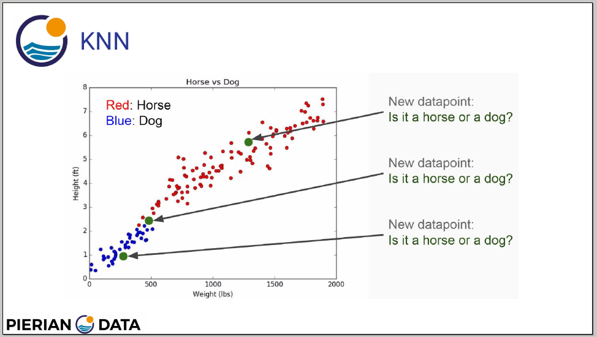
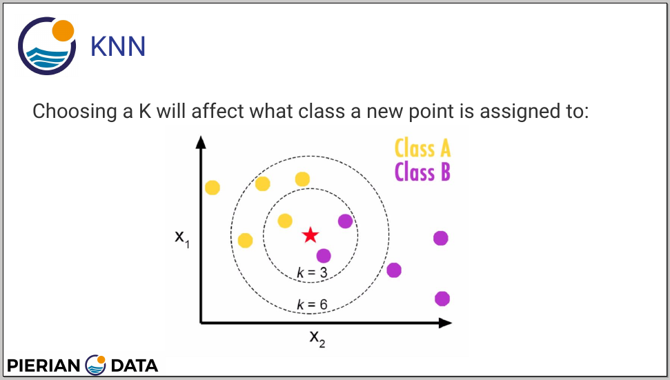

# 14-k-nearest-neighbors_01-k_nearest_neighbors_with_python

K-Nearest Neighbors offers two type of modeling data:

- Regression:



- Classification:




It has two types of parameters:

- *k*: the number of the neighbors points to predict/classify a new data point
- *Distance metric*: what type of the distance (euclidean or not) to use to predict/classify a new data point

### Pros

- Very simple
- Training is trivial
- Works with any number of classes
- Easy to add more data
- Few parameters

### Cons

- High prediction cost (worse for large data sets)
- Not good with high dimensional data
- Categorical features don't work well

## Practice

Load libraries

```python
import pandas as pd
import numpy as np
import matplotlib.pyplot as plt
import seaborn as sns
%matplotlib inline

from sklearn.preprocessing import StandardScaler
from sklearn.model_selection import train_test_split
from sklearn.neighbors import KNeighborsClassifier
from sklearn.metrics import classification_report, confusion_matrix
```

Load data

```python
df = pd.read_csv('Refactored_Py_DS_ML_Bootcamp-master/14-K-Nearest-Neighbors/Classified Data', index_col=0)

df.head()

df.columns = map(str.lower, df.columns)
df.columns = df.columns.str.replace(' ', '_')

df.head()
```

Preprocessing data

> Because KNN predict/classify data by proximity, scaled data matters!

```python
scaler = StandardScaler()
scaler.fit(df.drop('target_class', axis=1))
scaled_features = scaler.transform(df.drop('target_class', axis=1))
scaled_features
df_feat = pd.DataFrame(scaled_features, columns=df.columns[:-1])
df_feat.head()

# check mean
df_feat.mean().round()

# check sd
df_feat.std().round()
```

Split data

```python
X = df_feat
y = df['target_class']
X_train, X_test, y_train, y_test = train_test_split(X, y, test_size=0.3, random_state=101)
```

Training data

```python
# KNeighborsClassifier(
#     n_neighbors=5,
#     weights='uniform',
#     algorithm='auto',
#     leaf_size=30,
#     p=2,
#     metric='minkowski',
#     metric_params=None,
#     n_jobs=None,
#     **kwargs
#     )
knn = KNeighborsClassifier(n_neighbors=1)

knn.fit(X_train, y_train)
```

Predicting

```python
pred = knn.predict(X_test)
```

Evaluating

```python
print(confusion_matrix(y_test, pred))

print(classification_report(y_test, pred))
```

Using elbow method to choose the better *k* parameters

```python
error_rate = []

for i in range(1, 40):
    knn = KNeighborsClassifier(n_neighbors = i)
    knn.fit(X_train, y_train)
    pred_i = knn.predict(X_test)
    error_rate.append(np.mean(pred_i != y_test))

plt.figure(figsize=(10, 6))
plt.plot(range(1, 40), error_rate, color='blue', linestyle='dashed', marker='o', markerfacecolor='red', markersize=10)
plt.title('Error rate vs K value')
plt.xlabel('K')
plt.ylabel('Error rate')
```

Repeating the training with the best *k* value (17)

```python
knn = KNeighborsClassifier(n_neighbors=17)
knn.fit(X_train, y_train)

pred = knn.predict(X_test)

print(confusion_matrix(y_test, pred))
print(classification_report(y_test, pred))
```
